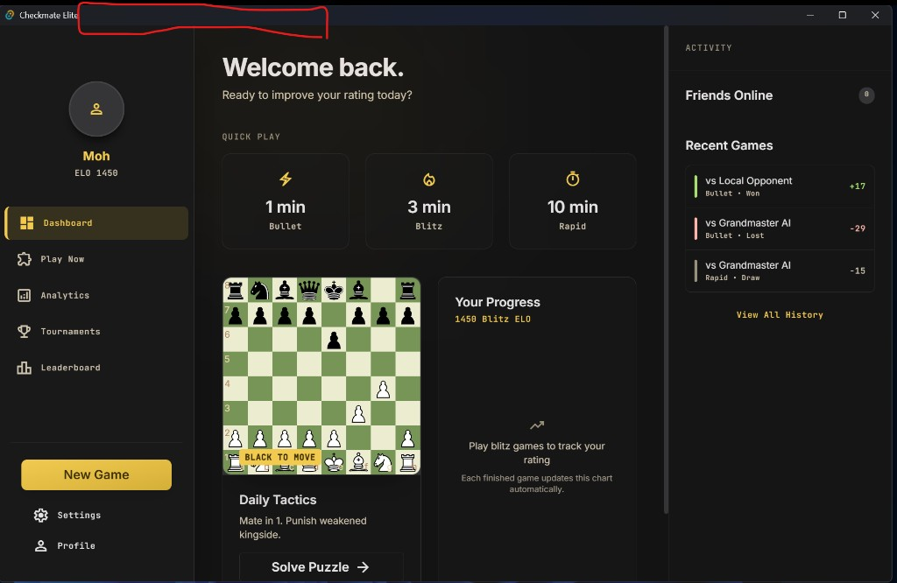
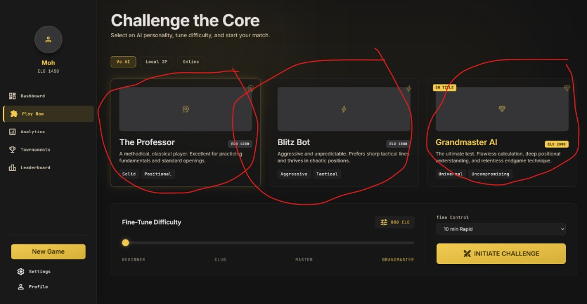
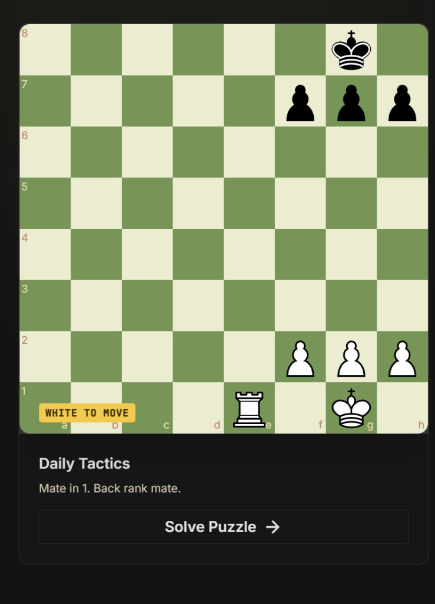
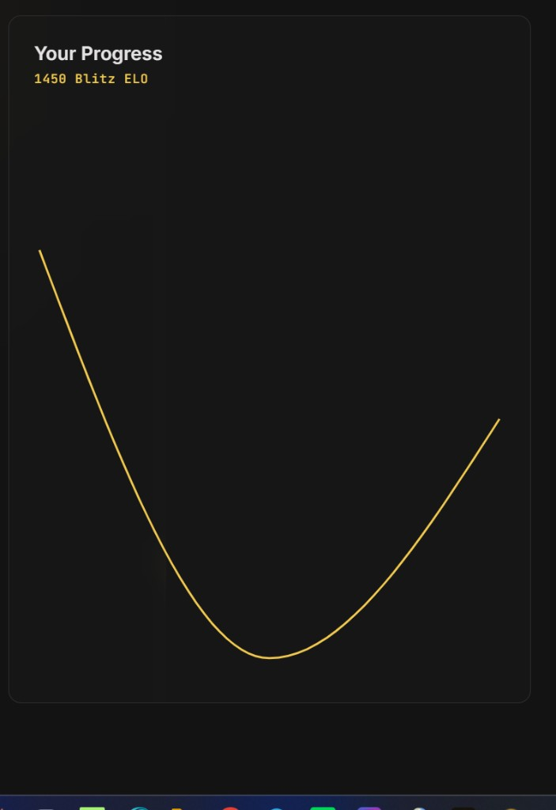
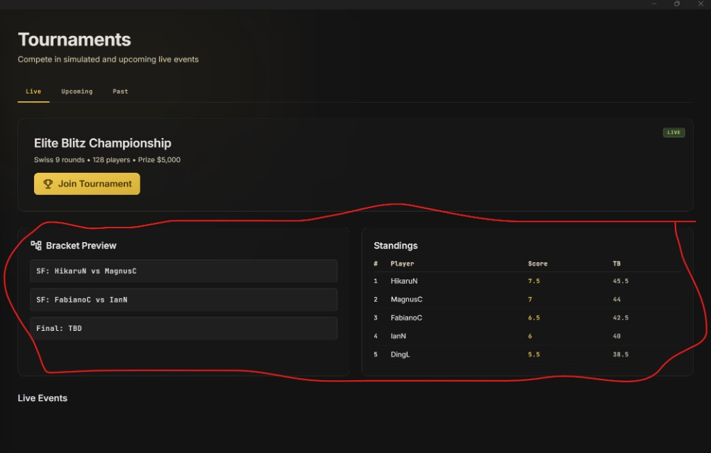

# Checkmate Elite

A modern desktop chess app for playing, training, and tracking your progress. Built with **Tauri 2**, **React 19**, and **TypeScript**, featuring a dark gold-themed UI and **Stockfish**-powered AI opponents.

[](https://github.com/MohOneX/Checkmate-Elite)
[](https://tauri.app/)
[](LICENSE)

---

## Screenshots

### Dashboard
Quick play, daily tactics puzzles, blitz rating progress, and recent activity.



### Play vs AI
Choose an AI personality, tune difficulty from 800–2800 ELO, and start a match.



### Daily Tactics
Interactive puzzle board with random puzzles when you click **Solve Puzzle**.



### Rating Progress
Track your blitz rating over your last games with a readable chart.



### Tournaments
Online-ready tournament hub (live data when backend is connected).



---

## Features

### Play
- **vs AI** — Stockfish engine with adjustable strength (800–2800 ELO slider)
- **AI personalities** — The Professor, Blitz Bot, Grandmaster AI
- **Local 2-player** — Pass-and-play on the same device
- **Time controls** — Bullet, Blitz, Rapid, and Unlimited
- **Online mode** — UI ready; backend integration coming soon

### Train
- **Daily Tactics** — Puzzle of the day on the dashboard
- **Random puzzles** — Solve Puzzle loads a random tactic from the puzzle pool
- **Analytics** — Import PGN, engine analysis, evaluation graph, move review

### Track
- **Dashboard** — Quick play shortcuts, rating progress chart, recent games
- **Profile** — Ratings by time control, win/loss/draw stats, activity heatmap, achievements, game history
- **Leaderboard & Tournaments** — Ready for online mode; empty until API is connected

### Customize
- **Board themes** — Classic, Blue, Brown
- **Gameplay options** — Legal moves, move sounds, promotion, analysis depth
- **Data management** — Export/import backup JSON, **Reset all data** for a fresh start

---

## Tech Stack

| Layer | Technology |
|-------|------------|
| Desktop shell | [Tauri 2](https://tauri.app/) |
| Frontend | React 19, TypeScript, Vite |
| Styling | Tailwind CSS 4 |
| Chess logic | [chess.js](https://github.com/jhlywa/chess.js) |
| Board UI | [react-chessboard](https://github.com/Clariity/react-chessboard) |
| Engine | Stockfish (Web Worker) |
| Charts | Recharts |
| State | Zustand |
| Persistence | Tauri Store / localStorage |

---

## Prerequisites

- **Node.js** 18+ and npm
- **Rust** — required for Tauri desktop builds ([install Rust](https://rustup.rs/))
- **Platform dependencies** — see [Tauri prerequisites](https://v2.tauri.app/start/prerequisites/)

---

## Getting Started

### Clone and install

```bash
git clone https://github.com/MohOneX/Checkmate-Elite.git
cd Checkmate-Elite
npm install
```

### Run desktop app (recommended)

```bash
npm run tauri dev
```

### Run web preview only

```bash
npm run dev
```

Open [http://localhost:1420](http://localhost:1420). Some desktop features fall back to `localStorage` in the browser.

### Build installer

```bash
npm run tauri build
```

Installers are output under:

```
src-tauri/target/release/bundle/
```

---

## Environment Variables

Optional — for future online features:

| Variable | Description |
|----------|-------------|
| `VITE_API_URL` | Backend API base URL. When set, leaderboard and tournaments load from the server. |

Example `.env`:

```env
VITE_API_URL=https://your-api.example.com
```

---

## Project Structure

```
checkmate-elite/
├── docs/
│   └── screenshots/      # App screenshots for README
├── src/
│   ├── app/              # Router and app entry
│   ├── components/       # UI, layout, chess components
│   ├── features/         # Page views (Dashboard, Play, Profile, …)
│   ├── stores/           # Zustand state
│   ├── services/         # API client and persistence
│   ├── engine/           # Stockfish wrapper
│   ├── data/             # Puzzles, achievements
│   └── lib/              # Utilities, ELO math, constants
├── public/               # Static assets (Stockfish, AI art)
└── src-tauri/            # Tauri / Rust backend
```

---

## Data & Privacy

All gameplay data is stored **locally** on your device:

- Profile, ratings, and achievements
- Game history (up to 200 games)
- Settings and preferences

Use **Settings → Export Data** to back up, or **Reset All Data** to start fresh.

---

## Roadmap

- [ ] Online matchmaking and live multiplayer
- [ ] Cloud profile sync and authentication
- [ ] Live leaderboard and tournaments from backend API
- [ ] Puzzle validation and rating on solve
- [ ] Friends list and social features

---

## Scripts

| Command | Description |
|---------|-------------|
| `npm run dev` | Vite dev server (web) |
| `npm run build` | TypeScript check + production build |
| `npm run preview` | Preview production build |
| `npm run tauri dev` | Desktop app in development |
| `npm run tauri build` | Build desktop installer |

---

## Contributing

Contributions are welcome!

1. Fork the repository
2. Create a feature branch (`git checkout -b feature/my-feature`)
3. Commit your changes
4. Push and open a Pull Request

---

## License

This project is licensed under the [MIT License](LICENSE).

---

## Author

**[MohOneX](https://github.com/MohOneX)** — Checkmate Elite

<p align="center">Built with ♟️ and Stockfish</p>
